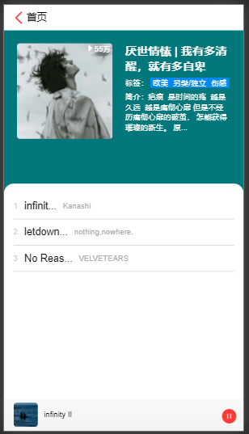
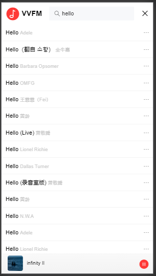
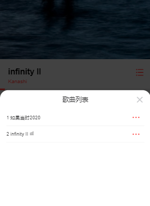

# vant-vue-fm

## 简介

基于 vue 的开的单页面应用 —— 音乐app（移动端），[点这里预览](https://elgara.gitee.io/demo/vv/#/)。

功能：
- 搜索歌曲
- 歌曲播放页面：mini组件, 播放组件，播放记录页面
- 主页：轮播图，最新音乐，推荐歌单，歌单详情页面
- 热评：热门评论

使用到的技术：
- vue（框架）
- vue-cli（脚手架）
- vue-router（路由）
- vuex（状态管理）
- vant （UI组件库）
- less（css 预处理语言）

## 页面效果

| 主页面 | 播放器 | 歌单详情 |
| ---- | ---- | ---- | ---- |
|  |  |  |

| 搜索 | 评论 | 播放记录 |
| ---- |---- | ---- |---- |
|  | |  |